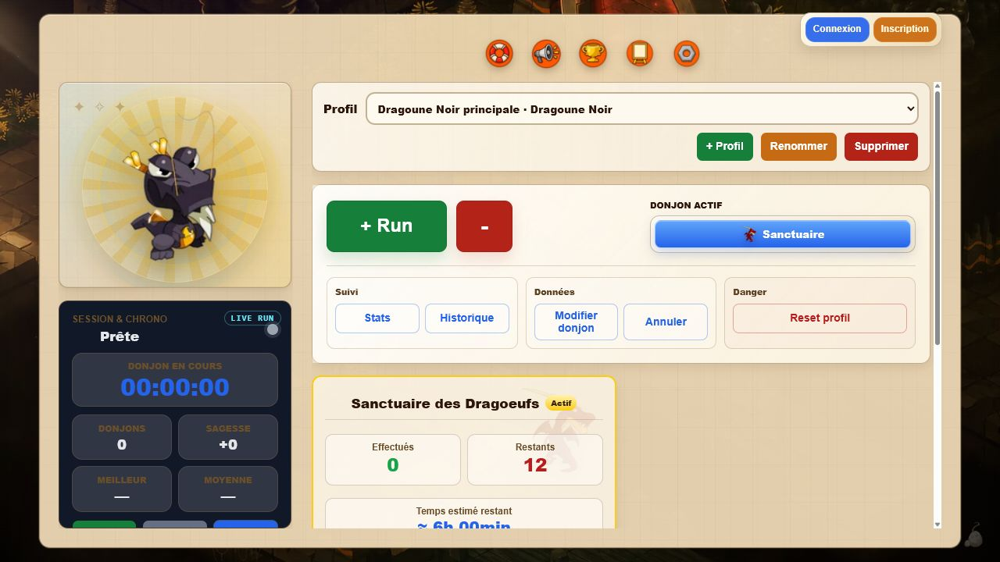
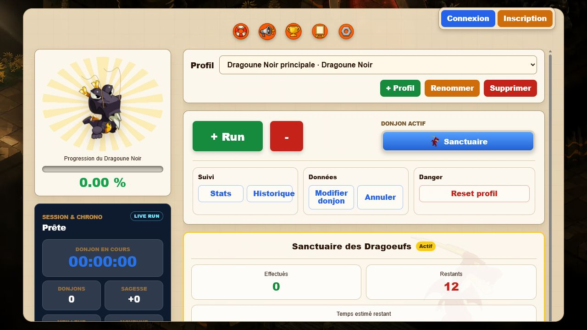
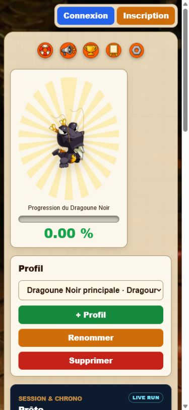

# Pykur Tracker V2 - Rapport de phase 4

**Phase :** 4 - Reconstruction du layout statique  
**Date :** 28 juin 2026  
**État :** terminée, en attente de validation  
**Périmètre :** présentation uniquement, sans logique métier.

## 1. Travail réalisé

Le layout V1 a été reproduit statiquement dans la V2 avec un profil Dragoune Noir représentatif.

Éléments reconstruits :

- fond familier ;
- panneau principal parchemin ;
- barre d’actions illustrée ;
- bloc de connexion ;
- grille desktop à deux colonnes ;
- carte du familier et progression ;
- panneau Session & Chrono ;
- sélecteur de profil ;
- commandes de profil ;
- bloc + Run / - Run ;
- donjon actif ;
- groupes Suivi, Données et Danger ;
- carte de donjon ;
- bloc de bonus ;
- résumé de projection ;
- accès Monstres et Changelog ;
- structure générique de modale ;
- organisation responsive desktop, tablette et mobile.

Tous les boutons sont statiques. Aucun calcul, stockage, listener ou appel API n’a été branché.

## 2. Fichiers modifiés

- v2/index.html
- v2/mobile.html
- v2/css/variables.css
- v2/css/base.css
- v2/css/layout.css
- v2/css/dashboard.css
- v2/css/components.css
- v2/css/cards.css
- v2/css/buttons.css
- v2/css/forms.css
- v2/css/modals.css
- v2/css/themes.css
- v2/css/responsive.css

Fichiers de preuve ajoutés :

- v2/docs/phase4-v1-1280x720.png
- v2/docs/phase4-v2-1280x720.png
- v2/docs/phase4-v2-390x844.png
- v2/docs/phase4-v2-1920x1080.png
- v2/docs/phase4-v2-1600x900.png
- v2/docs/phase4-v2-1600x900-bottom.png

## 3. Comparaison géométrique à 1280×720

| Mesure | V1 | V2 |
| --- | ---: | ---: |
| Panneau principal | 1180×684 | 1180×684 |
| Position du panneau | x 50, y 18 | x 50, y 18 |
| Largeur du layout interne | 1130 | 1130 |
| Position du layout | x 75 | x 75 |
| Overflow horizontal | aucun | aucun |

La hauteur interne diffère de 2 px en raison des bordures et espacements reconstruits, sans effet sur la composition.

## 4. Comparaison visuelle

### V1

### V2

### V2 mobile

## 5. Stratégie responsive appliquée

- largeur intrinsèque plafonnée à 1180 px ;
- colonne latérale de 298 px sur desktop large ;
- colonne ramenée à 256 px sur desktop compact ;
- passage en flux vertical sous 768 px ;
- cartes et contrôles redimensionnés par Grid/Flex ;
- modales limitées par 100dvh ;
- aucun positionnement artificiel du contenu principal ;
- aucun transform: scale ;
- aucun zoom CSS ;
- aucun overflow horizontal.

## 6. Résultats multi-résolutions

| Résolution | Layout visible | Images | Overflow horizontal | Modale masquée |
| --- | --- | --- | --- | --- |
| 1920×1080 | OK | OK | Non | Oui |
| 1600×900 | OK | OK | Non | Oui |
| 1536×864 | OK | OK | Non | Oui |
| 1440×900 | OK | OK | Non | Oui |
| 1366×768 | OK | OK | Non | Oui |
| 1280×720 | OK | OK | Non | Oui |
| 1024×768 | OK | OK | Non | Oui |
| 768×1024 | OK | OK | Non | Oui |
| 390×844 | OK | OK | Non | Oui |

À 1920×1080, le chrono, la projection et le bouton Monstres sont visibles simultanément.
Entre 1280×720 et 1600×900, le chrono reste entièrement contenu dans la colonne
latérale et le panneau central possède un défilement interne donnant accès à la
projection et au bouton Monstres.

## 7. Défauts détectés et corrigés pendant la phase

### Modale affichée malgré hidden

Cause : la déclaration display:grid de .modal-layer se trouvait après la règle générique [hidden].

Correction : ajout du sélecteur plus spécifique .modal-layer[hidden], sans !important.

### Scroll vertical desktop permanent

Cause : fusion de la marge supérieure du panneau avec le body ayant min-height:100vh.

Correction : création d’un nouveau contexte de formatage avec display:flow-root.

### Débordement du chrono à 390 px

Cause : largeur héritée du parent avant son passage à display:contents.

Correction : largeur mobile explicite et bornée à 100 %.

### Hauteur desktop plafonnée et contenu inférieur inaccessible

Cause : le panneau principal était limité à une hauteur maximale fixe de 684 px,
indépendamment de la hauteur réelle de l'écran.

Correction : hauteur desktop liée au viewport, colonne latérale recalculée et
défilement interne conservé uniquement lorsque la hauteur disponible l'exige.

### Chrono tronqué dans la colonne latérale

Cause : les hauteurs internes du chrono dépassaient son conteneur aux résolutions
compactes, et les boutons utilisaient leur largeur minimale de contenu dans la grille.

Correction : variantes verticales selon la hauteur, grille en `minmax(0, 1fr)` et
boutons bornés à la largeur disponible.

### Projection et bouton Monstres absents de la première vue

Cause : la barre Profil occupait inutilement deux lignes sur desktop, ce qui repoussait
les derniers blocs hors du panneau même sur un écran 1920×1080.

Correction : barre Profil desktop sur une seule ligne. La projection et Monstres sont
désormais entièrement visibles à 1920×1080 et accessibles par le scroll interne sur
les hauteurs inférieures.

## 8. Qualité CSS de la phase 4

- 0 !important ;
- 0 zoom CSS ;
- 0 transform: scale utilisé pour le layout ;
- breakpoints uniques à 1200, 1024, 768 et 560 px ;
- z-index issus des variables ;
- dimensions des images et contrôles stabilisées ;
- focus visible prévu sur formulaires et boutons ;
- modales avec scroll interne.

## 9. Limites volontaires

Cette phase ne contient pas :

- chargement de profil ;
- changement de familier ;
- calcul de progression ;
- chrono actif ;
- ouverture de modale ;
- notifications ;
- options ;
- import/export ;
- événements ;
- social ;
- administration.

Ces éléments appartiennent à la phase 5, migrée module par module après validation.

## 10. Vérifications de périmètre

- aucune fonctionnalité V1 migrée ;
- aucun fichier V1 modifié ;
- aucun asset V1 copié ;
- assets V1 seulement référencés pour la comparaison visuelle ;
- JavaScript V2 toujours neutre ;
- aucune phase 5 commencée.

## 11. Décision attendue

Validation explicite de la phase 4 avant la première migration fonctionnelle de phase 5.
